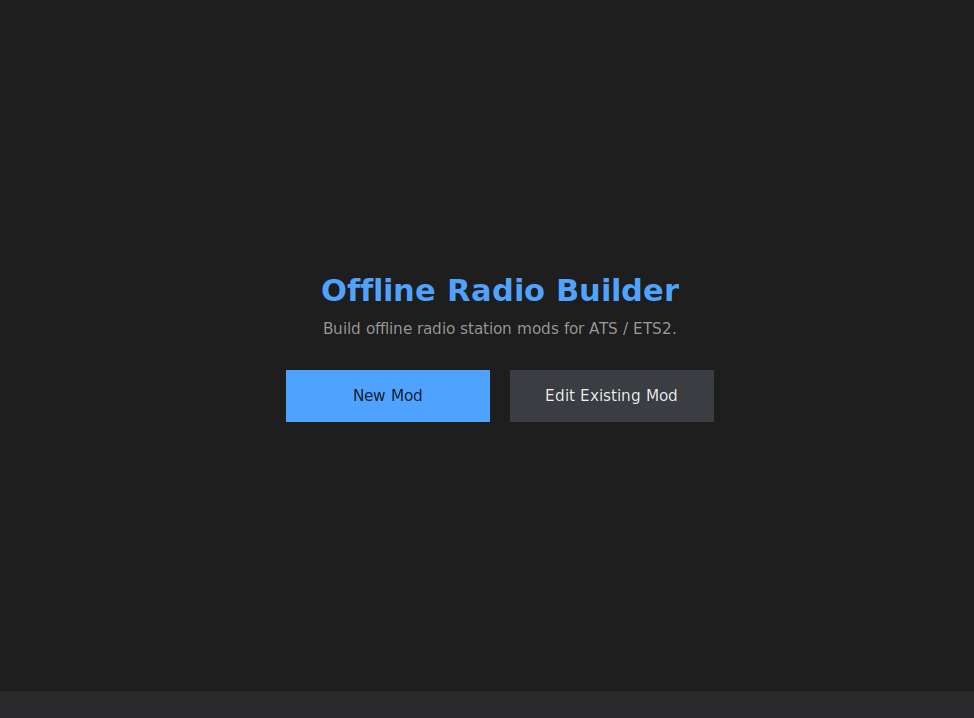
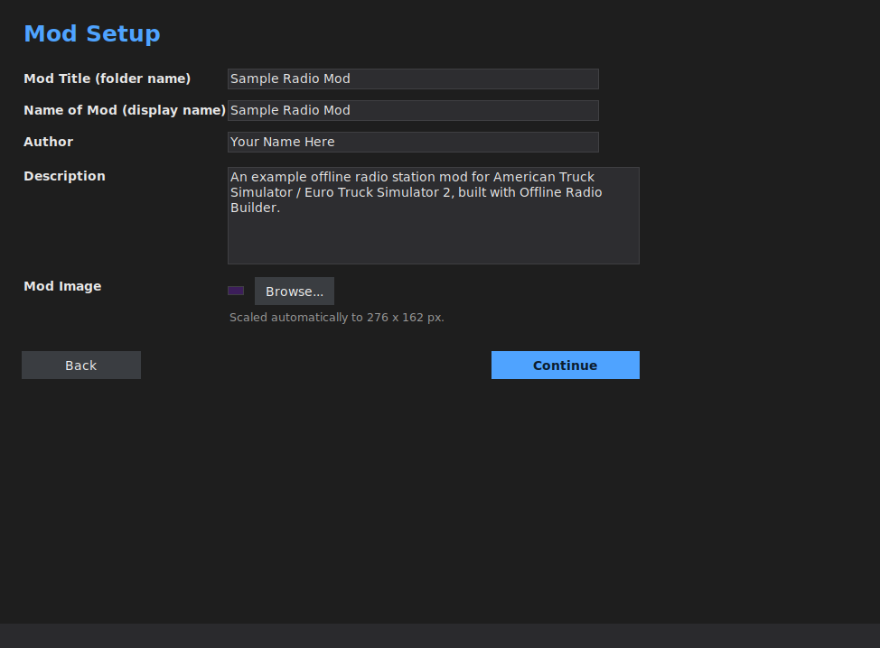
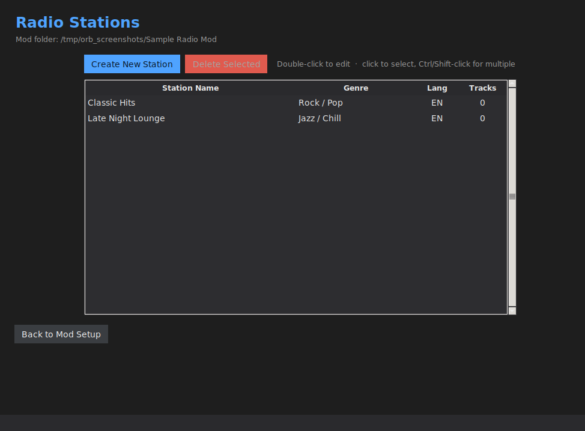
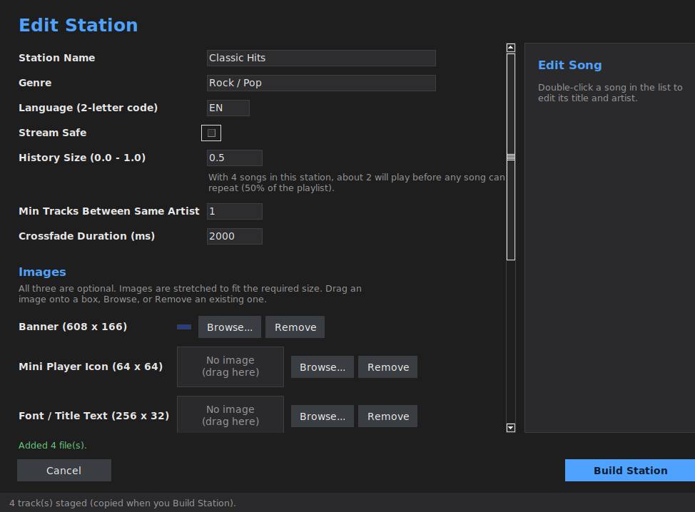
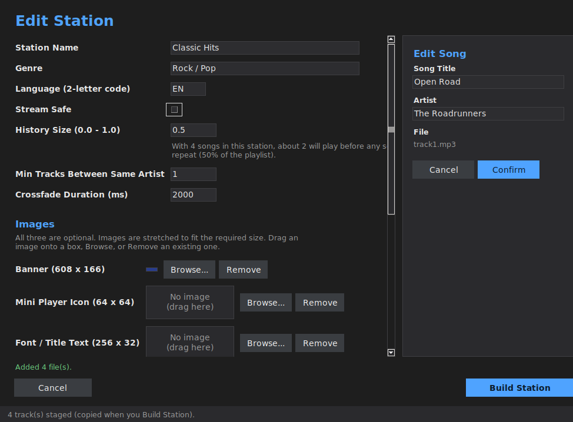

<div align="center">


# Offline Radio Builder

**A desktop tool for building offline radio station mods for American Truck Simulator and Euro Truck Simulator 2.**

No manual `.sii` editing, no hand-crafted `.dds`/`.tobj` files, no guessing at SCS's undocumented formats.

*Windows, macOS, and Linux builds available.*

</div>

---

## What it does

Offline Radio Builder walks you through everything needed to ship a working offline-radio mod:

- **Mod scaffolding** — generates `manifest.sii`, `mod_description.txt`, and a properly-sized `mod_icon.jpg` (auto-scaled to 276x162)
- **Station management** — create, edit, and delete as many stations as you want, each with its own genre, language, stream-safe flag, history size, and crossfade duration
- **UI images** — drop in a banner, mini player icon, and font/title image; the app converts them to the exact `.dds` format the game expects (correct pixel format, correct dimensions, correct `.mat`/`.tobj` pairing — including the SDF material format the font texture specifically needs) and lets you remove any of them later
- **Track listing** — drag and drop `.mp3`/`.ogg` files in, reads ID3/Vorbis tags automatically, falls back to the filename when tags are missing, and lets you edit any track's title/artist by hand
- **One-click build** — nothing touches disk until you hit **Build Station**; everything is staged first, then written in one pass with a progress dialog

Everything is generated to match the real, in-game-tested `.sii`/`.dds`/`.mat`/`.tobj` formats — including several undocumented details (the `token` attribute's 12-character limit, the exact binary `.tobj` header layout, and the fact that a station's on-disk folder name must exactly equal its `id`) that aren't written down anywhere official and will silently break a mod if you get them wrong.

## Screenshots

| Welcome | Mod Setup |
|---|---|
|  |  |

| Radio Stations |
|---|
|  |

| Create / Edit Station |
|---|
|  |
|  |

## Getting started

### Option 1 — Download the build

Grab the latest build for your platform from [Releases](../../releases):

- **Windows** — `OfflineRadioBuilder.exe`, no install needed
- **macOS** — `OfflineRadioBuilder.dmg`, open it and drag the app to Applications
- **Linux** — `OfflineRadioBuilder-x86_64.AppImage`, works across most distros with nothing else to install

**macOS note:** the app isn't signed with an Apple Developer certificate, so Gatekeeper will block it on first launch ("cannot be opened because the developer cannot be verified"). Either right-click the app → **Open** → confirm, or run `xattr -cr /Applications/OfflineRadioBuilder.app` in Terminal once.

**Linux note:** AppImages need the executable bit set before they'll run: `chmod +x OfflineRadioBuilder-x86_64.AppImage && ./OfflineRadioBuilder-x86_64.AppImage`. A plain (non-AppImage) binary is also available in the same release if you'd rather run it directly.

### Option 2 — Run from source

```bash
git clone https://github.com/<your-username>/OfflineRadioBuilder.git
cd OfflineRadioBuilder
pip install -r requirements.txt
python main.py
```

Requires Python 3.9+. `tkinterdnd2` is optional (enables drag-and-drop); everything also works via the Browse buttons without it.

On Linux, `tkinter` itself isn't a pip package — install it via your distro's package manager if `python main.py` complains it's missing: `sudo apt install python3-tk` (Debian/Ubuntu), `sudo dnf install python3-tkinter` (Fedora), or `sudo pacman -S tk` (Arch).

### Building your own executable

```bash
# Windows
build.bat

# macOS
./build_mac.sh

# Linux
./build_linux.sh
```

All three install `pyinstaller` and everything in `requirements.txt`, then build a windowed executable with the app's icon and version metadata embedded — `dist\OfflineRadioBuilder.exe` on Windows, `dist/OfflineRadioBuilder.app` on macOS, and both a plain binary and a `dist/OfflineRadioBuilder-x86_64.AppImage` on Linux. PyInstaller can't cross-compile, so each has to actually run on that OS; the same `.spec` file handles all three.

## How a mod gets built

1. **New Mod** → pick a folder → fill in title, display name, author, description, and (optionally) an icon
2. **Create Station** → name, genre, language, and playback settings
3. Drop in banner/mini player/font images and your track list
4. **Build Station** — the app writes the station's `.sii` block, converts and writes every image asset, copies your tracks into place, and updates `tracks.sii`
5. Repeat for as many stations as you want, then copy the mod folder into your `mod` directory (or package it as a `.scs`) as usual

## Project structure

```
main.py                    Entry point
project.py                 Mod-level state: manifest.sii, description, icon
station_ops.py              Station create/edit/delete, folder & id management
radio_sii.py / tracks_sii.py   .sii readers/writers
dds_writer.py               DX10 DDS file writer (public Microsoft spec)
tobj_writer.py               Binary .tobj writer (reverse-engineered, see file for notes)
material_assets.py          Orchestrates image -> .dds/.mat/.tobj conversion
track_ops.py / audio_metadata.py   Track copying + ID3/Vorbis tag reading
theme.py                     Dark theme applied across the whole UI
ui/                          Tkinter screens

OfflineRadioBuilder.spec     PyInstaller build config (Windows .exe + macOS .app + Linux binary/AppImage, same file)
build.bat / build_mac.sh / build_linux.sh   One-command local builds per platform
icon.ico / icon.icns / icon.png   App icons (Windows / macOS / Linux)
offlineradiobuilder.desktop  Linux desktop entry (used when packaging the AppImage)
version_info.txt             Embedded Windows file version metadata
.github/workflows/build.yml  CI: builds all three platforms on every version tag
```

## Requirements

- Python 3.9+
- [Pillow](https://pypi.org/project/Pillow/) — image conversion
- [mutagen](https://pypi.org/project/mutagen/) — ID3/Vorbis tag reading
- [tkinterdnd2](https://pypi.org/project/tkinterdnd2/) *(optional)* — drag-and-drop

## A note on the `.tobj` format

`.dds` follows the public Microsoft DDS specification directly, so that part is fully documented and reliable. SCS has never published the `.tobj` binary format, though — this project's writer is built against real, working reference files and cross-checked against the open-source [ConverterPIX](https://github.com/mwl4/ConverterPIX) project, but it isn't officially confirmed. If a station's banner or icon doesn't show up in-game, that's the file to suspect first.

## License

[MIT](LICENSE) — do whatever you want with it.

## Credits

Built by Mercurius for the ATS/ETS2 modding community.
